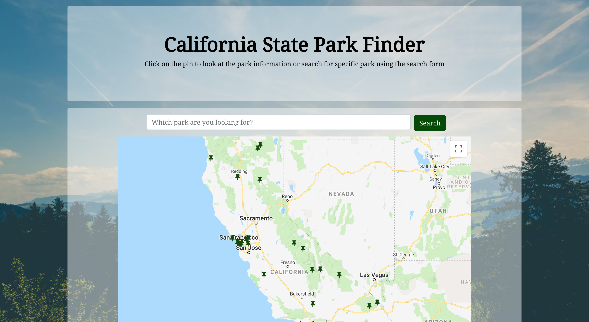

# State Park Finder

## Description 
This application allows users to find state parks in California on the map and view the park's information. Each pin on the map represents a state park. By clicking on the pin, the park's information will show up in a modal. See it live 

## Deployment
Check it out [HERE](https://yusungsamuel.github.io/state-park-finder/)

## Getting Started
These instructions will get you a copy of the project up and running on your local machine.

### Installing

+ Clone to a local repository.
+ Required packages - `npm i`

## Technologies Used 
+ HTML
+ CSS
+ bootstrap 
+ Javascript
+ React.js
+ Node.js

